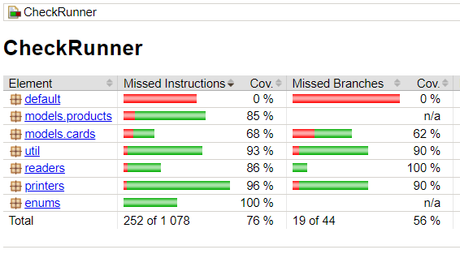

# store-checks-project (test task)

Приложение, реализующее функционал формирования чека в магазине.  
Использованные технологии: Java 17 SE, Gradle 7.5.

- основной класс `CheckRunner` в методе `main` принимает массив строк `args` и парсит его;
- если на вход пришло имя файла, класс `InputFileReader` пытается прочитать данные из него. При положительном
исходе передаёт считанные данные обратно в массив `args`, в противном случае работа программы завершается. Файл 
для считывания следует помещать в папку `...\scr\main\resources\`;
- если на вход переданы сами данные, они парсятся с помощью регулярных выражений. Если данные переданы некорректно,
работа программы завершается;
- после ввода номера дисконтной карты обработка данных завершается. Даже если в массиве `args` ещё есть данные,
они не будут учтены;
- класс `ProductsFactory` - это фабрика по производству продуктов на основе переданного `LinkedHashMap`;
- класс `CardsFactory` - фабрика, производящая дисконтные карты на основе заданного массива чисел;
- чек формируется в классе `CheckMaker` с помощью `StringBuilder`;
- класс `CheckPrinter` получает список товаров от `ProductsFactory`, применяет скидки, вычисляет сэкономленную 
сумму;
- класс `CheckWriter` записывает чек в папку с архивом. Расположение папки: `...\archive`. Если папку удалить,
`CheckWriter`создаст её снова. В текущем репозитории в папке `archive` можно увидеть примеры чеков.

Чтобы запустить проект, нужно собрать его с помощью команды `gradle clean test build`. Собранный файл `gradle` 
скопирует в корень папки с проектом, откуда его можно запустить командой `java -jar CheckRunner.jar`, 
добавив аргументы.

Отчет о покрытии тестами (JaCoCo):

